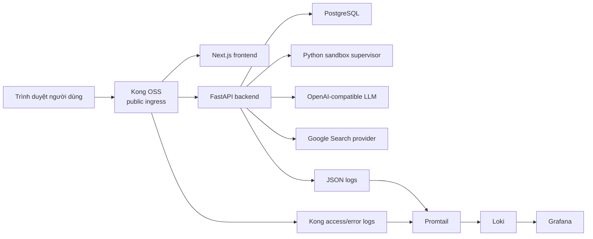
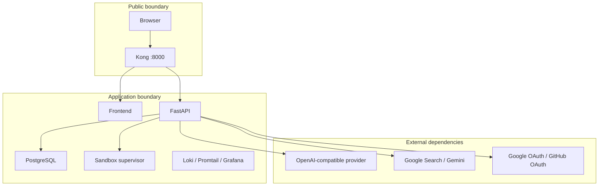
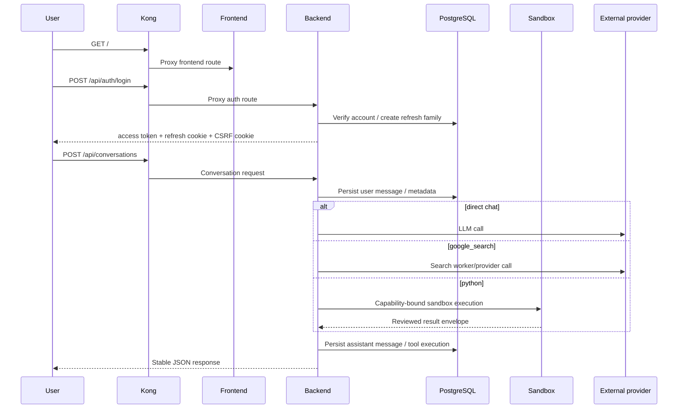
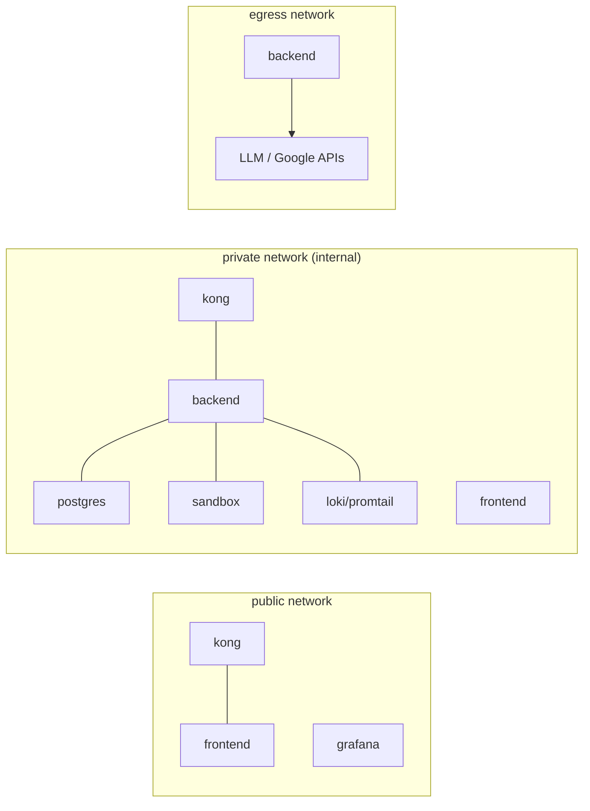

# Kiến trúc SimpAgent

Tài liệu này mô tả kiến trúc đang có trong repo, không mô tả một trạng thái “mong muốn” khác. Điểm cần giữ trung thực là search hiện chạy qua service logic trong backend, còn sandbox Python là boundary container riêng.

## Thành phần chính

## Ranh giới tin cậy

## Luồng request chính

## Luồng mạng Compose

## Diễn giải topology hiện tại

- `kong` là entrypoint public duy nhất của ứng dụng local ở `http://localhost:8000`.
- `frontend` được publish qua Kong route `/`.
- `backend` nằm trên `private` để nói chuyện với `postgres`, `sandbox`, và observability; đồng thời có thêm `egress` để gọi provider bên ngoài khi được cấu hình.
- `postgres`, `sandbox`, `promtail`, `loki` không được expose ra public port ứng dụng.
- `grafana` có port public riêng `http://localhost:3001` cho mục đích local observability.

## Những điểm cần hiểu đúng

- Search không phải một container riêng trong `compose.yaml`; logic search hiện được backend gọi qua service boundary và provider boundary, rồi persist kết quả an toàn.
- Python tool không chạy trong process FastAPI. Backend chỉ điều phối, cấp capability token, nhận envelope kết quả, và lưu metadata đã review.
- Kong có thể chặn coarse-grained request như CORS, body quá lớn, rate limit; nhưng token, role, scope, ownership, guardrail, và tool policy vẫn do FastAPI quyết định.
- Tài liệu này không che đi planning debt của Phase 3: artifact planning cho search vẫn chưa được reconcile đẹp trong `.planning`, dù behavior hiện tại đã có trong code và test.
